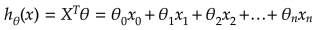

# Linear Regression
When the target variable (y) that we are trying to predict is continues value, and depends on one or multiple independent
variables (X), we call the learning problem a regression problem. Some of the examples for regression is predicting the age of
someone, predicting stock prices, predicting prices of an item, and etc. For example, the following figure shows the
following figure shows the observed data points, and simple linear regression line representing those data points.

  


On the image above there is an example of dependency between input variable x and output variable y. The red line in the above graph 
is referred to as the best fit straight line. Based on the given data points (training examples), we try to plot a line that 
models the points the best. In the real world scenario we normally have more than one input variable.
 
 If the target variable is discrete values, 
 the problem is classification problem, such as finding nationality, or gender of someone. 

## Variables
There are two variables the represent the linear regression:

The feature variables, represented with X.


_n_ - number of features

_R<sup>n+1</sup>_ - vector of _n+1_ real numbers

Target variable, represented with y and is a simple vector of dimension [mx1] where m is the number of training samples.

## Linear regression hypothesis
A linear regression line has an equation of the form 
h<sub>&theta;</sub>(x) = &theta;<sub>o</sub> x + &theta;<sub>1</sub>x<sub>1</sub> , where X is the explanatory variable and Y is the dependent
 variable. The slope of the line is &theta;<sub>1</sub>, and &theta;<sub>o</sub> is the intercept (the value of y when x = 0). In a more
 general forme, the linear regression hypothesis has the following form:
 
 
 
 where in this equation, X is feature values and &theta; is the parameters of the linear regression hypothesis. 
 The main objective of a linear regression algorithm is to estimate the values of these &theta; using a learning algorithm.
 The vector of parameters &theta; has the following form.
 In this equation X<sub>0</sub> is the bias term and it is always equal to one. The following code snippet shows how to 
 take the X matrix and a vector of ones in its first column.
 
 ```python
def reshape_features(self, X):
    # if it is uni-variate linear regression
    if len(X.shape) == 1:
        m = len(X)
        X = np.stack((np.ones(m), X), axis=1)
    else:
        m = X.shape[0]
        X = np.concatenate([np.ones((m, 1)), X], axis=1)
    return X
```
 
 
  
  
## Normal Equation
One way to solve the values of &theta; is to use the normal equation shown bellow. It is a stright forward equation
that takes the matrix of features X and vector of targets y and calculates the &theta;. 

  

The following code snipped shows how to calculated the $theta; parameters using the normal equations:
 
 ```python
def normal_equation_fit(self, X, y):
    # add vector of ones for X0 (bias term)
    X = self.reshape_features(X)
    # calculate the normal equation
    theta = np.dot(np.dot(np.linalg.inv(np.dot(X.T, X)), X.T), y)
    return theta
```

  
Since this equation requires the inverse operation, it can become computationally expensive for problems with 
large number of features. Another method is to change the values of &theta; until we minimize the error in the model
and select the best values of &theta;. This method will be presented using the gradient descent algorithm.
  
  
 ## Cost function
 We want to find the parameters &theta; such that it fits the data in a best possible manner. To do that we need to reduce
 the model error. This model error, is called cost function and can be represented using sum of mean squared error.
 It means that we are summing the square of error values (actual - prediction) for all training data, as shown in the following:
 
  
 
 _x<sup>i</sup>_ - input (features) of _i<sup>th</sup>_ training example

_y<sup>i</sup>_ - output of _i<sup>th</sup>_ training example

_m_ - number of training examples

## Gradient descent algorithm

Gradient descent is an iterative optimization algorithm for finding the minimum of a cost function described above. 
To find a local minimum of a function using gradient descent, one takes steps proportional to the negative of the
 gradient (or approximate gradient) of the function at the current point.

 
 
We need to simultaneously update &theta;<sub>j</sub> for _j = 0, 1, ..., n_


&alpha; :  is the learning rate, the constant that defines the size of the gradient descent step

x<sup>(i)</sup><sub>j</sub>: is the _j<sup>th</sup>_ feature value of the _i<sup>th</sup>_ training example

x<sup>(i)</sup>: is the input (features) of _i<sup>th</sup>_ training example

_y<sup>i</sup>_ - output of _i<sup>th</sup>_ training example

_m_ - number of training examples

_n_ - number of features

> When we use term "batch" for gradient descent it means that each step of gradient descent uses **all** the
> training examples (as you might see from the formula above).
>
The following code snipped show how to calculate the &theta; parameters using the gradient descent algorithm.

 ```python
class LinearRegression:
    def __init__(self, learning_rate=0.01, iteration=500):
        self.learning_rate = learning_rate
        self.cost_history = []
        self.iteration = iteration
    def gradient_descent_fit(self, X, y):
        # add vector of ones for X0 (bias term)
        X = self.reshape_features(X)
        # m is the number of training sample
        m = y.size
        # initialize the theta parameters. We start with a vector of zeros
        theta = np.zeros(X.shape[1])
        for i in range(self.iteration):
            # calculate the linear regression hypothesis
            h_theta = np.dot(X, theta)
            # calculate the cost
            cost = (1 / (2 * m)) * (np.sum(np.square(h_theta - y)))
            # add the cost to the history
            self.cost_history.append(cost)
            # change the value of theta using the learning rate and the gradient
            theta = theta - (self.learning_rate / m) * (h_theta - y).dot(X)
        return theta
```

## Feature scaling
To make linear regression and gradient descent algorithm work correctly we need to make sure that features are on a similar scale.

-1 < x<sub>i</sub> < 1

For example "apartment size" feature (e.g. 120 m<sup>2</sup>) is much bigger than the "number of rooms" feature (e.g. 2).

In order to scale the features we need to do **mean normalization**


x<sub>j</sub><sup>(i)</sup> is the _j<sup>th</sup>_ feature value of the _i<sup>th</sup>_ training example

&mu;<sub>j</sub> is the average value of _j<sup>th</sup>_ feature in training set

s<sub>j</sub> is the standard deviation of feature in training set.

The following code snipped show how to calculate the mean, standard deviation of features and how to normalize the 
samples based on them. The return mean and sigm will be used to normalize the test set for prediction.


 ```python
def normalize_features(self, X):
    # calculate the mean of features
    mu = np.mean(X, axis=0)
    # calculate the standard deviation of features
    sigma = np.std(X, axis=0)
    # normalize the features
    X_norm = (X - mu) / sigma
    # return mean, standard deviation and normalized features
    return X_norm, mu, sigma
```